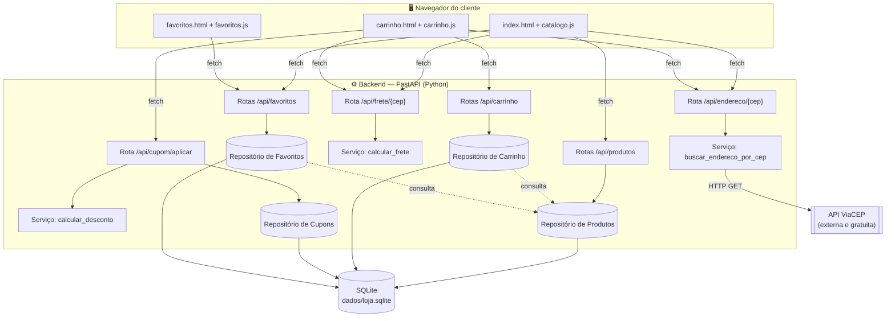
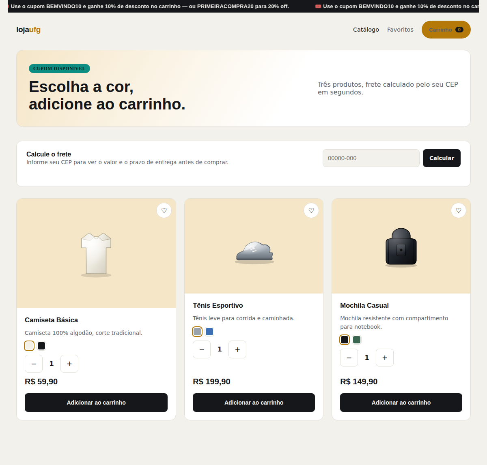
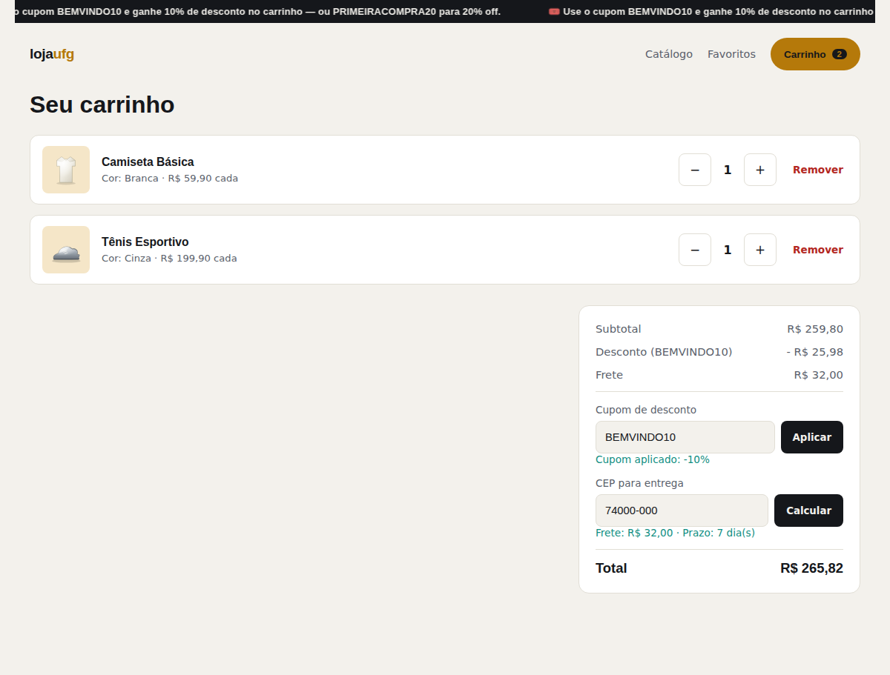
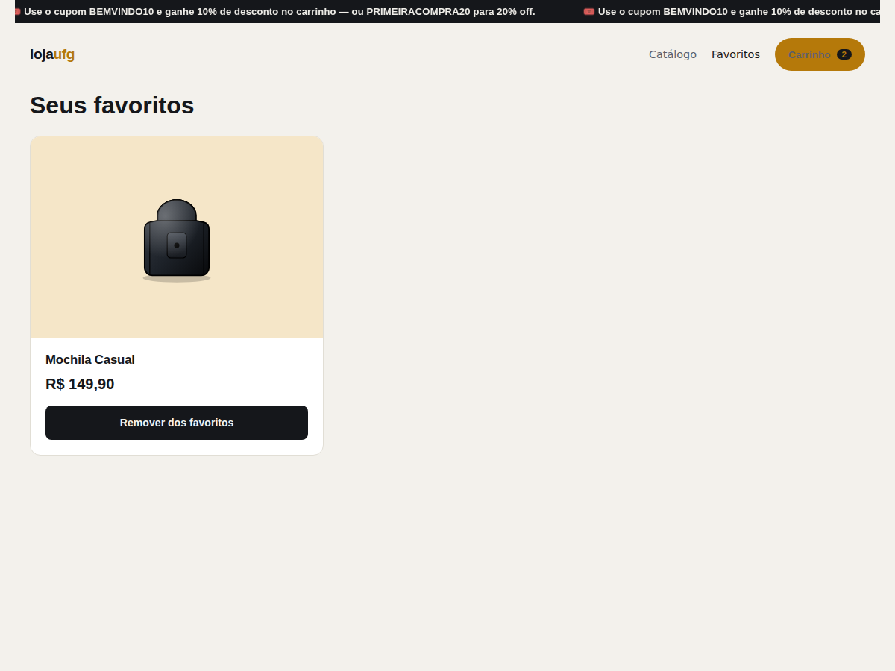

# 🛒 Loja Virtual — Mini-Projeto UFG

> Simulação de página de vendas de produtos com carrinho de compras,
> cálculo de frete/desconto e integração com API de CEP, desenvolvida
> como MVP para o laboratório de Inteligência Artificial Generativa da
> Pós-Graduação em Engenharia de Software da UFG.

<p align="center">
  
  
  
  
  
</p>

## Descrição do projeto

Este projeto é um **MVP (Produto Mínimo Viável)** que simula uma loja
virtual com três produtos, permitindo explorar, na prática, o uso de
Inteligência Artificial Generativa em diferentes etapas do ciclo de vida
do desenvolvimento de software: planejamento, estruturação, geração de
código, testes automatizados, documentação e refatoração.

A aplicação roda em **servidor local** e está **empacotada** para
ser testada pelo avaliador da atividade, sem custos com APIs ou serviços pagos.

### Funcionalidades principais

- 🛍️ Catálogo com 3 produtos, cada um com fotos e opções de cor (a foto
  muda ao trocar a cor selecionada)
- 🛒 Carrinho de compras: incluir, excluir e alterar quantidade de itens
- ⭐ Favoritar produtos, com página dedicada de favoritos
- 🏷️ Cupom de desconto sobre o valor da compra, recalculado
  automaticamente quando a quantidade de itens muda
- 📍 Busca de endereço a partir do CEP (API pública ViaCEP), disponível
  tanto no catálogo quanto no carrinho
- 🚚 Cálculo de frete simulado a partir do CEP informado
- 📣 Letreiro digital anunciando os cupons de desconto disponíveis
- 📑 Documentação interativa da API (Swagger/OpenAPI, gerada pelo FastAPI)

---

## Sumário

- [Descrição do projeto](#descrição-do-projeto)
- [Tecnologias utilizadas](#tecnologias-utilizadas)
- [Pré-requisitos](#pré-requisitos)
- [Instalação passo a passo](#instalação-passo-a-passo)
- [Uso e exemplos](#uso-e-exemplos)
- [Exemplos de requisições para os endpoints principais](#exemplos-de-requisições-para-os-endpoints-principais)
- [Arquitetura do sistema](#arquitetura-do-sistema)
- [Estrutura do projeto](#estrutura-do-projeto)
- [Como a IA acelerou este projeto](#como-a-ia-acelerou-este-projeto)
- [Capturas de tela](#capturas-de-tela)
- [Versão de entrega / Release](#versão-de-entrega--release)
- [Limitações e próximos passos](#limitações-e-próximos-passos)
- [Autores e contribuição](#autores-e-contribuição)
- [Licença](#licença)

---

## Tecnologias utilizadas

| Camada | Tecnologia |
|---|---|
| Backend | [Python 3.11+](https://www.python.org/) + [FastAPI](https://fastapi.tiangolo.com/) |
| Servidor ASGI | [Uvicorn](https://www.uvicorn.org/) |
| Banco de dados | [SQLite](https://www.sqlite.org/) (nativo do Python, via `sqlite3`) |
| Validação de dados | [Pydantic](https://docs.pydantic.dev/) |
| Configuração | [python-dotenv](https://pypi.org/project/python-dotenv/) (variáveis de ambiente via `.env`) |
| Frontend | HTML5 + CSS3 + JavaScript (vanilla) |
| API de CEP | [ViaCEP](https://viacep.com.br/) (pública e gratuita) |
| Testes | [pytest](https://docs.pytest.org/) + [httpx](https://www.python-httpx.org/) |
| Documentação de API | Swagger UI / ReDoc (gerados automaticamente pelo FastAPI) |

---

## Pré-requisitos

- [Python 3.11 ou superior](https://www.python.org/downloads/) instalado
- [pip](https://pip.pypa.io/en/stable/installation/) (geralmente já
  incluso na instalação do Python)
- Navegador web atualizado (Chrome, Firefox, Edge, etc.)
- Conexão com a internet (apenas para a consulta de CEP via ViaCEP)

> _Nenhuma chave de API ou serviço pago é necessário para executar o
> projeto._

---

## Instalação passo a passo

```bash
# 1. Clonar o repositório
git clone https://github.com/Renan-O-Moreira/mini_projeto_UFG.git
cd mini_projeto_UFG

# 2. Criar e ativar um ambiente virtual
python -m venv venv
source venv/bin/activate      # Linux/macOS
venv\Scripts\activate         # Windows

# 3. Instalar as dependências
pip install -r requirements.txt

# 4. (Opcional) copiar o arquivo de variáveis de ambiente
# A aplicação já roda com os valores padrão sem este passo.
cp .env.example .env

# 5. Iniciar a aplicação
python main.py
```

Após iniciar, acesse:

- Aplicação: <http://localhost:8000>
- Documentação interativa da API (Swagger): <http://localhost:8000/docs>

### Variáveis de ambiente (`.env`)

Veja [`.env.example`](.env.example) — todas são opcionais e a aplicação
funciona com os padrões abaixo caso o arquivo `.env` não seja criado:

| Variável | Padrão | Descrição |
|---|---|---|
| `HOST` | `127.0.0.1` | Endereço em que o servidor escuta |
| `PORT` | `8000` | Porta em que o servidor escuta |
| `RELOAD` | `true` | Reinício automático ao alterar o código (use `false` em ambientes de teste/entrega) |

### Executando os testes automatizados

```bash
pip install -r requirements-dev.txt
pytest testes/ -v
```

O projeto conta com **84 testes automatizados** (unitários e de
integração), incluindo um teste de integração de ponta a ponta que
percorre o fluxo completo de compra (catálogo → carrinho → cupom →
frete → CEP → favoritos).

A evidência completa da execução dos testes (saída literal do
terminal, distribuição por módulo e a falha real revelada e corrigida
durante o TDD) está documentada em
[`docs/evidencias/evidencias_testes.md`](docs/evidencias/evidencias_testes.md).

---

## Uso e exemplos

1. **Catálogo** (`/`): veja os 3 produtos disponíveis, escolha a cor
   desejada (a foto do produto muda automaticamente), ajuste a
   quantidade e clique em **Adicionar ao carrinho**. Você também pode
   favoritar um produto clicando no ícone de coração, ou calcular o
   frete e ver o endereço de entrega informando um CEP no topo da
   página.
2. **Carrinho** (`/carrinho.html`): altere a quantidade de cada item
   ou remova-os, aplique um cupom de desconto (`BEMVINDO10` ou
   `PRIMEIRACOMPRA20`) e informe o CEP para calcular o frete — o
   resumo com subtotal, desconto, frete e total é atualizado em tempo
   real.
3. **Favoritos** (`/favoritos.html`): veja os produtos que você
   favoritou e remova-os quando quiser.

Veja a seção [Capturas de tela](#capturas-de-tela) para exemplos
visuais de cada etapa.

---

## Exemplos de requisições para os endpoints principais

```bash
# Listar todos os produtos do catálogo
curl -X GET "http://localhost:8000/api/produtos"

# Incluir um item no carrinho
curl -X POST "http://localhost:8000/api/carrinho" \
  -H "Content-Type: application/json" \
  -d '{"produto_id": 1, "nome_cor": "Branca", "quantidade": 2}'

# Alterar a quantidade de um item do carrinho
curl -X PATCH "http://localhost:8000/api/carrinho/1" \
  -H "Content-Type: application/json" \
  -d '{"quantidade": 3}'

# Aplicar um cupom de desconto
curl -X POST "http://localhost:8000/api/cupom/aplicar" \
  -H "Content-Type: application/json" \
  -d '{"codigo": "BEMVINDO10", "valor_total": 100.00}'

# Calcular o frete para um CEP
curl -X GET "http://localhost:8000/api/frete/74000-000"

# Buscar o endereço de um CEP (via ViaCEP)
curl -X GET "http://localhost:8000/api/endereco/74000-000"

# Favoritar um produto
curl -X POST "http://localhost:8000/api/favoritos" \
  -H "Content-Type: application/json" \
  -d '{"produto_id": 1}'
```

A lista completa e interativa de todos os endpoints está disponível no
Swagger, em <http://localhost:8000/docs>, assim que a aplicação estiver
em execução.

---

## Arquitetura do sistema

O diagrama abaixo resume os principais componentes do sistema: as
páginas do frontend, as camadas do backend (rotas → serviços/repositórios
→ banco de dados) e a integração externa com a ViaCEP.



---

## Estrutura do projeto

```text
mini_projeto_UFG/
├── app/                          # Backend (FastAPI)
│   ├── main.py                   # Ponto de entrada da aplicação
│   ├── config.py                 # Configurações gerais
│   ├── banco_dados/
│   │   ├── conexao.py             # Conexão e inicialização do SQLite
│   │   └── esquema.sql            # Esquema das tabelas
│   ├── modelos/                  # Modelos Pydantic (produto, carrinho, cupom, frete, endereco, favorito)
│   ├── repositorios/              # Acesso a dados (produtos, carrinho, cupons, favoritos)
│   ├── servicos/                  # Regras de negócio (cupom, frete, endereco/ViaCEP)
│   └── rotas/                     # Endpoints da API por domínio
│
├── frontend/                      # Frontend estático (servido pelo FastAPI)
│   ├── index.html                 # Catálogo
│   ├── carrinho.html              # Carrinho de compras
│   ├── favoritos.html             # Produtos favoritados
│   ├── css/estilos.css
│   ├── js/                        # api.js, catalogo.js, carrinho.js, favoritos.js
│   └── imagens/produtos/          # Ilustrações SVG dos produtos (por cor)
│
├── testes/                        # 84 testes automatizados (pytest)
│   ├── conftest.py                # Fixtures compartilhadas
│   ├── test_modelo_*.py           # Testes unitários dos modelos
│   ├── test_repositorio_*.py      # Testes unitários dos repositórios
│   ├── test_servico_*.py          # Testes unitários dos serviços
│   ├── test_api_*.py              # Testes de integração das rotas
│   └── test_integracao_fluxo_completo.py  # Teste de integração ponta a ponta
│
├── docs/imagens/                  # Capturas de tela usadas neste README
│
├── main.py                        # Script de start (lê variáveis de ambiente)
├── requirements.txt                # Dependências de produção
├── requirements-dev.txt            # Dependências de desenvolvimento/teste
├── .env.example                    # Modelo de variáveis de ambiente
├── .gitignore
├── README.md
└── LICENSE
```

---

## Como a IA acelerou este projeto

A IA generativa (Claude) foi utilizada como parceira de trabalho em
praticamente todas as etapas do ciclo de vida do desenvolvimento, sempre
com um humano analisando os resultados e validando cada decisão relevante
antes de seguir adiante (*human on the loop*).

- **Contextualização do laboratório**: o projeto foi apresentado ao
  agente por meio de um prompt estruturado no modelo **CO-STAR**
  (Contexto, Objetivo, Estilo, Tom, Audiência e Resposta), garantindo
  que as sugestões seguintes já nascessem alinhadas aos objetivos e
  restrições do laboratório de IA generativa da UFG.
- **Definição da stack tecnológica**: em vez de já chegar impondo uma
  stack, pedi ao agente um esboço das tecnologias necessárias para o
  escopo do MVP e, em seguida, um levantamento comparativo de prós e
  contras de cada alternativa (por exemplo, Node.js/Express versus
  Python/FastAPI, e Flask versus FastAPI). Com esse levantamento em
  mãos, a decisão final sobre qual stack e quais ferramentas adotar foi
  minha.
- **Planejamento incremental guiado pelo contexto**: a partir da
  contextualização inicial e da definição da estrutura de pastas, o
  agente fez sugestões das etapas lógicas de construção do projeto
  (módulo a módulo do backend, depois o frontend, depois a
  documentação), sempre submetidas à minha avaliação e aprovação antes
  de avançar. A estrutura de pastas do projeto, em particular, foi
  proposta pelo agente e só implementada após minha validação.
- **Governança do fluxo de commits**: criei um arquivo de instruções
  (não versionado no repositório) definindo regras para as sugestões de
  commit seguindo as práticas de **Conventional Commits**. A partir
  dele, toda operação de commit passou a ser primeiro apresentada por
  escrito — título, tipo e descrição — para minha avaliação e aprovação
  explícita antes de ser executada.
- **Desenvolvimento orientado a testes (TDD)**: cada módulo do backend
  (produtos, carrinho, cupom, frete, endereço, favoritos) foi
  implementado seguindo o ciclo **Red → Green → Refactor**: primeiro os
  testes unitários eram escritos e executados para confirmar que
  falhavam (Red); em seguida, implementava-se o código mínimo necessário
  para fazê-los passar (Green); por fim, o código era refatorado para
  incorporar as proteções reveladas pelos próprios testes (Refactor).
  Esse processo revelou pelo menos uma falha real durante o
  desenvolvimento (dependência frágil do evento de inicialização do
  banco de dados), corrigida antes de seguir em frente.
- **Testes automatizados**: ao final, o projeto conta com 84 testes
  unitários e de integração, incluindo simulação de chamadas HTTP
  externas (`httpx.MockTransport`) para testar a integração com a
  ViaCEP sem depender de rede real.
- **Pesquisa e design do frontend**: antes de desenhar as telas, pedi
  ao agente uma pesquisa na web sobre boas práticas e características de
  sites de venda online bem-sucedidos, adaptada ao tamanho do MVP. A
  partir dessa pesquisa, foram geradas três propostas visuais completas
  (paletas e disposições diferentes) para escolha, e só então o
  frontend final foi implementado consumindo as APIs do backend.
- **Depuração assistida**: identificação e correção de bugs reais
  encontrados durante a validação manual (por exemplo, o desconto do
  cupom não sendo recalculado ao alterar a quantidade de itens no
  carrinho).
- **Documentação incremental**: em vez de deixar a documentação para o
  final, pedi ao agente para ir completando o `README.md` à medida que
  cada etapa do projeto avançava, incluindo o diagrama de arquitetura,
  os exemplos de requisições e as capturas de tela deste documento.

---

## Capturas de tela

### Catálogo

Escolha de cor com troca de foto, cálculo de frete/endereço pelo CEP e
letreiro com os cupons disponíveis.



### Carrinho de compras

Itens com quantidade ajustável, cupom de desconto aplicado e resumo com
subtotal, desconto, frete e total.



### Favoritos

Produtos favoritados a partir do catálogo, com opção de remover.



---

## Versão de entrega / Release

| Versão | Data | Descrição |
|---|---|---|
| `v1.0.0` | _a definir_ | Versão final de entrega da atividade |

---

## Limitações e próximos passos

### Limitações conhecidas

- Cálculo de frete é **simulado** com base em regras locais (não
  utiliza API paga de transportadoras/Correios)
- Catálogo restrito a 3 produtos fixos, sem cadastro dinâmico de novos
  produtos
- Sem autenticação de usuários (favoritos e carrinho são de sessão
  única, sem múltiplos usuários)
- Ilustrações dos produtos são vetoriais (SVG), não fotos reais

### Próximos passos (fora do escopo do MVP)

- Autenticação e múltiplos usuários
- Integração com API real de frete
- Painel administrativo para cadastro de produtos
- Persistência de carrinho entre sessões/dispositivos
- Fotos reais dos produtos em substituição às ilustrações vetoriais

---

## Autores e contribuição

| Nome | Contato |
|---|---|
| Renan O. Moreira | reom19@gmail.com |

Contribuições são bem-vindas por meio de _issues_ e _pull requests_.

---

## Licença

Este projeto está licenciado sob os termos definidos no arquivo
[LICENSE](LICENSE).
