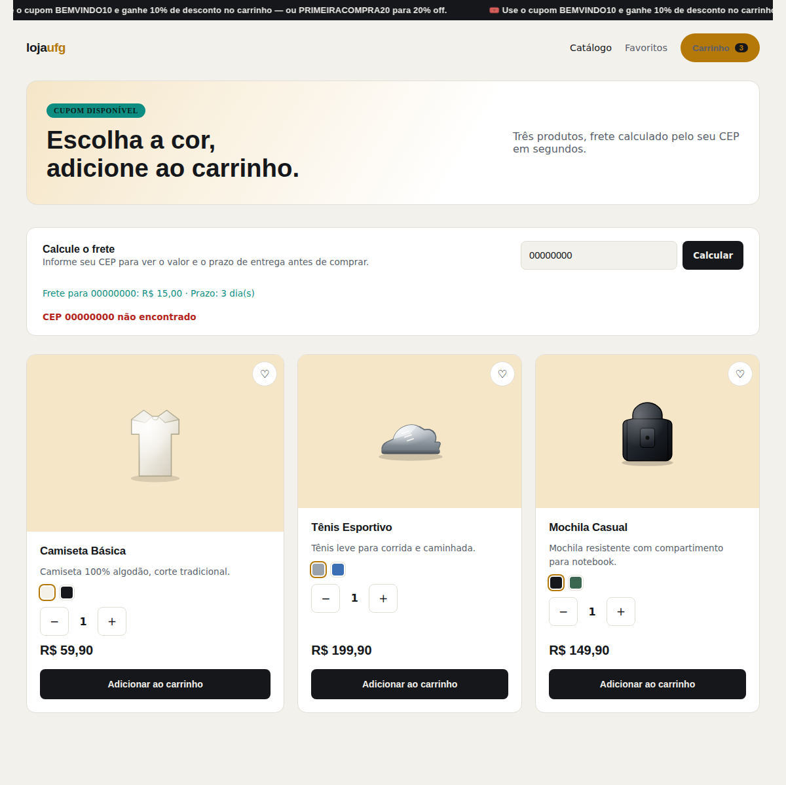
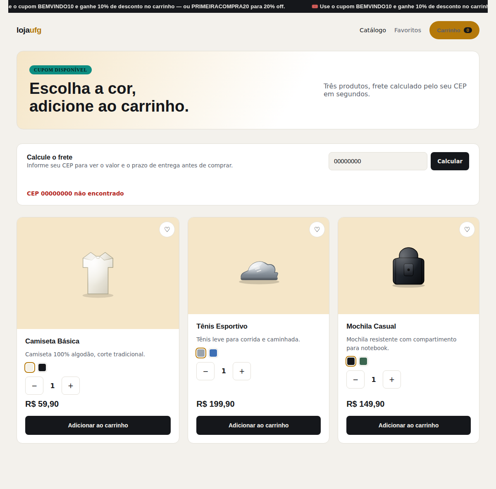
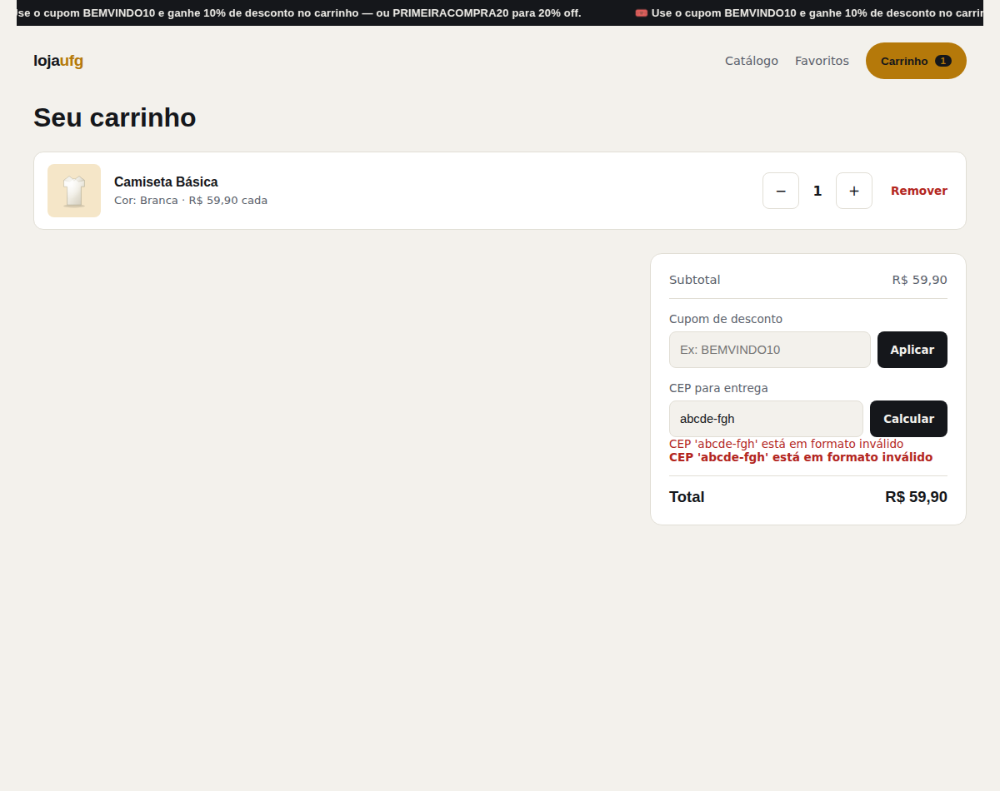

# Correção: CEP inexistente não informava erro de endereço

## Como o problema foi encontrado

Durante testes manuais realizados **na perspectiva do avaliador**
(seguindo o próprio passo a passo de instalação e uso documentado no
`README.md`), foi informado o CEP `00000000` no campo de cálculo de
frete do catálogo. O sistema retornou normalmente o valor do frete e o
prazo de entrega, mas **nenhuma mensagem foi exibida sobre o
endereço** — como se a busca de CEP tivesse simplesmente sido ignorada,
sem indicar sucesso nem falha.

## Causa raiz

O comportamento do **backend já estava correto**: a rota
`GET /api/endereco/{cep}` já tratava CEPs não encontrados na ViaCEP
retornando `404` com uma mensagem clara (`"CEP {cep} não encontrado"`),
e isso já era coberto por testes automatizados
(`test_buscar_endereco_com_cep_inexistente_retorna_404` e
`test_buscar_endereco_com_cep_inexistente_gera_erro_de_nao_encontrado`).

O problema estava no **frontend**: tanto `catalogo.js` quanto
`carrinho.js` usavam `Promise.allSettled` para buscar frete e endereço
em paralelo, mas só tratavam o caso de **sucesso** da busca de
endereço. Quando a promessa era rejeitada (CEP não encontrado, ou
qualquer outra falha), o código simplesmente não fazia nada — nenhuma
mensagem de erro era exibida, e o usuário só via o resultado do frete
(que é sempre calculado, pois é uma simulação local baseada no
primeiro dígito do CEP, independente de o CEP ser real).

## Correção aplicada

Em `frontend/js/catalogo.js` e `frontend/js/carrinho.js`, foi
adicionado tratamento para o caso de falha na busca de endereço,
exibindo a mensagem de erro retornada pela API (ex: `"CEP 00000000 não
encontrado"`) na caixa de endereço, com um estilo visual distinto (texto
vermelho) via a nova classe CSS `.endereco-caixa.erro` em
`frontend/css/estilos.css`.

## Validação da correção

Como o backend já estava correto e coberto por testes automatizados,
a correção em si é puramente de frontend (não há framework de testes
automatizados para o frontend neste MVP). A validação foi feita
manualmente, simulando a resposta de "CEP não encontrado" da API e
confirmando visualmente o comportamento em ambas as páginas
(catálogo e carrinho):



Resultado observado nesta primeira correção, para o CEP `00000000`:

| Campo | Antes da correção | Depois da correção |
|---|---|---|
| Frete | R$ 15,00 · Prazo: 3 dia(s) | R$ 15,00 · Prazo: 3 dia(s) *(mantido nesta etapa)* |
| Endereço | Nenhuma mensagem exibida | **"CEP 00000000 não encontrado"** em destaque |

## Refinamento: ocultar frete e prazo quando o CEP não é válido

Após esta primeira correção, o avaliador identificou que, mesmo com a
mensagem de erro agora visível, o frete e o prazo de entrega
continuavam sendo exibidos normalmente para um CEP inexistente — o que
não fazia sentido do ponto de vista do usuário: se o endereço não é
reconhecido, o sistema não deveria informar valor nem prazo de entrega
para ele.

**Correção**: `catalogo.js` e `carrinho.js` foram reestruturados para
consultar o endereço **primeiro**; o frete só é consultado e exibido
se o endereço for confirmado pela ViaCEP. Se o endereço falhar (CEP
inexistente ou formato inválido), somente a mensagem de erro é
exibida, e nenhuma informação de frete/prazo aparece. No carrinho, o
valor de frete usado no cálculo do total também é zerado nesse caso.

Resultado final, para o CEP `00000000`:

| Campo | Comportamento final |
|---|---|
| Frete | **Não exibido** |
| Endereço | **"CEP 00000000 não encontrado"** em destaque |
| Total do carrinho | Recalculado sem incluir frete |



### Validação adicional: CEP com formato inválido (letras, tamanho incorreto)

Como a mesma correção trata qualquer falha na busca de endereço de
forma genérica (não apenas "não encontrado"), foi também validado que
informar um CEP com letras (`abcde-fgh`) ou fora do padrão (`123`)
exibe corretamente a mensagem de erro de formato — tanto no campo de
frete quanto na caixa de endereço, no catálogo e no carrinho:



Esse caso já era validado no backend pelos testes automatizados
(`test_calcular_frete_com_cep_de_formato_invalido_gera_erro`,
`test_buscar_endereco_com_formato_invalido_gera_value_error`, entre
outros); a verificação aqui confirma que o frontend também propaga
essa validação corretamente para o usuário.

A suíte completa de testes automatizados do backend foi reexecutada
após a correção, confirmando que nada foi impactado:

```
======================== 84 passed, 2 warnings in 0.57s ========================
```

Veja a saída completa em
[`saida_pytest_completa.txt`](saida_pytest_completa.txt).
